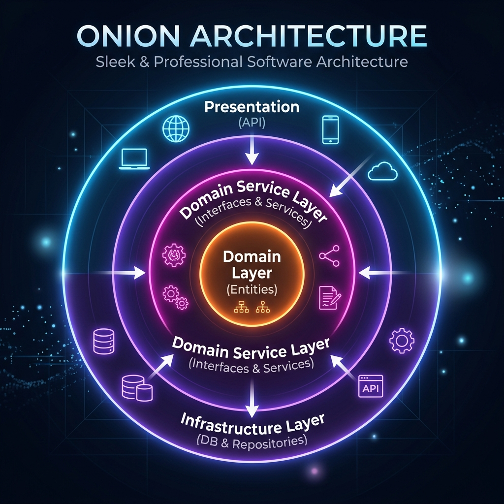

# OnionArchitectureDemo 🧅

Este repositório apresenta uma demonstração prática da implementação da **Onion Architecture (Arquitetura Cebola)** utilizando **.NET** (C#) e **Entity Framework Core**. O projeto demonstra o desacoplamento de dependências e a centralização das regras de negócio no núcleo da aplicação.

---

## 🏛️ O que é Onion Architecture?

Criada por **Jeffrey Palermo** em 2008, a Onion Architecture tem como premissa que as dependências devem apontar sempre para o centro da aplicação. O núcleo do sistema é composto pelo domínio (entidades e regras de negócio) e não depende de bancos de dados, frameworks de UI ou qualquer tecnologia externa.



### Principais Benefícios:
- **Testabilidade**: Como as regras de negócio estão no centro e não dependem de detalhes de infraestrutura, é extremamente simples testá-las isoladamente.
- **Desacoplamento**: O banco de dados ou a interface de apresentação podem ser trocados sem impactar as regras centrais.
- **Manutenibilidade**: Organização limpa e padronizada das responsabilidades de cada classe.

---

## 📁 Estrutura do Projeto

O repositório é dividido nas seguintes camadas:

### 1. 🎯 DomainLayer (Camada de Domínio)
É o núcleo da aplicação. Não possui dependências de outras camadas e contém os modelos de domínio e configurações de mapeamento de banco de dados.
- **Modelos**: 
  - `BaseEntity`: Classe abstrata contendo propriedades comuns a todas as entidades (`Id`, `CreateDate`, `ModifiedDate`, `IsActive`).
  - `Customer`: Entidade de negócio representando um cliente (`CustomerName`, `PurchasesProduct`, `PaymentType`).
- **Mapeamentos (EntityMapper)**: 
  - `CustumerMap`: Classe que implementa `IEntityTypeConfiguration<Customer>`, configurando como os campos do cliente serão mapeados na tabela do banco de dados utilizando Fluent API.

### 2. ⚙️ DomainServiceLayer (Camada de Serviços do Domínio)
Fica posicionada imediatamente acima do Domínio. É responsável por expor as operações e regras de negócio.
- **Interfaces**:
  - `ICustomerService`: Contrato que define as operações de CRUD disponíveis para clientes.
- **Serviços**:
  - `CustomerService`: Implementação dos fluxos de negócio de clientes, consumindo as abstrações de dados por meio de injeção de dependência do repositório (`IRepositoryBase<Customer>`).

### 3. 💾 InfrastructureLayer (Camada de Infraestrutura)
Fornece os recursos de infraestrutura física e de dados necessários para suportar o Core da aplicação.
- **Contexto (EF Core)**:
  - `ApplicationDbContext`: Contexto que herda de `DbContext` e aplica as configurações definidas no mapeamento (`CustumerMap`).
- **Repositório Genérico**:
  - `IRepositoryBase<T>`: Interface genérica de persistência de dados.
  - `RepositoryBase<T>`: Implementação concreta e genérica usando Entity Framework Core.
- **Migrations**: Histórico de migrações criadas para manter a estrutura do banco sincronizada.

### 4. 🌐 Presentation Layer (`OnionArchitectureMinimalAPI`)
Camada mais externa responsável por expor os pontos de entrada do sistema para o usuário ou sistemas integradores.
- **Controllers**:
  - `CustomerController`: Controlador que expõe endpoints REST para criação, leitura, atualização e deleção de clientes.
- **Configurações (`Program.cs`)**:
  - Ponto de entrada do executável.
  - Configura as dependências por Injeção de Dependência (DI):
    - `ApplicationDbContext` configurado para SQL Server.
    - Registro de repositórios genéricos como `Scoped`.
    - Registro do serviço `CustomerService` como `Transient`.
  - Configura a documentação OpenAPI e Scalar API Reference (em ambiente de desenvolvimento).

---

## 🛠️ Tecnologias Utilizadas

- **C# / .NET (Versão Recente)**
- **Entity Framework Core (EF Core)** - Para mapeamento objeto-relacional
- **SQL Server** - Banco de dados relacional padrão do projeto
- **Scalar OpenAPI** - Para geração de documentação e teste interativo da API

---

## 🚀 Como Executar o Projeto

1. **Pré-requisitos**:
   - .NET SDK instalado.
   - Instância ativa do SQL Server.

2. **Configuração da String de Conexão**:
   - No projeto `OnionArchitectureMinimalAPI`, abra o arquivo `appsettings.json` (ou `appsettings.Development.json`) e ajuste a propriedade `SqlConnectionString` para a URL do seu SQL Server local:
     ```json
     "ConnectionStrings": {
       "SqlConnectionString": "Server=SEU_SERVIDOR;Database=OnionArchitectureDemoDB;Trusted_Connection=True;TrustServerCertificate=True;"
     }
     ```

3. **Executar Migrations**:
   - No terminal, no diretório raiz da solução, execute o comando para aplicar as migrations e criar a base de dados:
     ```bash
     dotnet ef database update --project InfrastructureLayer --startup-project OnionArchitectureMinimalAPI
     ```

4. **Iniciar a Aplicação**:
   - Execute o projeto de API:
     ```bash
     dotnet run --project OnionArchitectureMinimalAPI
     ```
   - Acesse a interface do Scalar em seu navegador (normalmente em `https://localhost:<porta>/scalar/v1`) para explorar e testar os endpoints!

---

## 🎓 Créditos e Referências

Este projeto foi construído tomando como base conceitual e prática as explicações detalhadas no artigo do professor **Paulo Santos**:

* 📝 **Artigo Base**: [Aprendendo a arquitetura cebola em .NET 5 (XP Inc.)](https://medium.com/xp-inc/apreendendo-a-arquitetura-cebola-em-net-5-d2e06dcc9e8)
* 💡 Agradecimentos ao autor pelas excelentes diretrizes na estruturação de sistemas modulares, limpos e desacoplados no ecossistema .NET.
